# GKE Multi-Cluster Setup on GCP (Two Regions, Global Failover)

This repo is my submission for the GCP take-home assessment. I built one GCP project with two private GKE clusters in two regions, ran two stateless web apps on both, put a single global load balancer (Multi-cluster Ingress) in front of them, and locked it down with Cloud Armor, Workload Identity and Secret Manager. Logs go to BigQuery and I built a Grafana dashboard on top of them.

Everything on the infrastructure side is Terraform. The Kubernetes side is plain YAML applied with `kubectl`.

- Project: `gke-assessment`
- Regions: `us-central1` (primary) and `us-east1` (secondary)
- Public entry point: `http://130.211.22.144` (App A on `/`, App B on `/b`)

The screenshots below are from my own test runs. A Word copy of the same evidence is in `docs/GCP_Project_Output.docx`.

---

## 1. Architecture

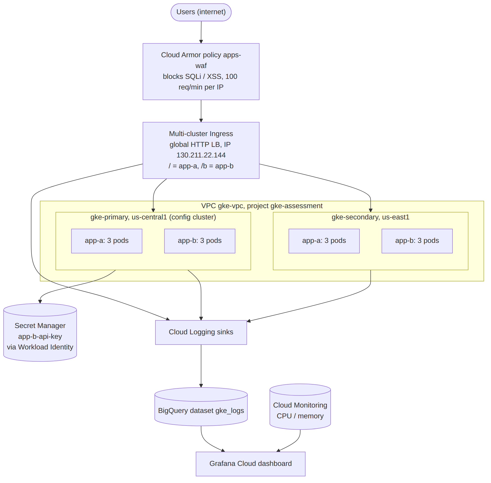

How a request flows:

1. A user hits the global IP `130.211.22.144`.
2. Cloud Armor checks the request first. SQL injection and XSS patterns get a 403, and anyone sending more than 100 requests a minute from one IP gets a 429.
3. Multi-cluster Ingress (a global external HTTP load balancer) picks the closest healthy cluster. From my location near Chicago that is always `gke-primary` in us-central1.
4. Traffic goes straight to pod IPs through NEGs (container-native load balancing), not through node ports.
5. If the pods for an app in the primary cluster go away, the load balancer health checks fail and traffic shifts to `gke-secondary` in us-east1 on its own. I tested this, see section 5.

The Mermaid source for the diagram is in `docs/architecture.mmd`.

---

## 2. What is in this repo

```
.
├── terraform/              # all GCP infrastructure
│   ├── versions.tf         # provider + GCS remote state backend
│   ├── provider.tf
│   ├── variables.tf
│   ├── terraform.tfvars.example
│   ├── network.tf          # VPC, subnets, Cloud Router/NAT, firewall, PSA
│   ├── iam.tf              # node SA, app SAs, CI/CD SA, team group roles
│   ├── registry.tf         # Artifact Registry (docker)
│   ├── gke.tf              # 2 private GKE clusters + node pools
│   ├── fleet.tf            # fleet, Multi-cluster Services + Ingress features
│   ├── workload-identity.tf # KSA -> GSA bindings
│   ├── lb.tf               # reserved global static IP
│   ├── cloud-armor.tf      # WAF + rate limiting policy
│   ├── secrets.tf          # Secret Manager secret + access for app-b only
│   ├── observability.tf    # BigQuery dataset + log sinks
│   ├── grafana.tf          # read-only SA for Grafana
│   └── outputs.tf
├── k8s/
│   ├── namespace.yaml
│   ├── app-a/app-a.yaml    # KSA, ConfigMap, Deployment, Service, HPA
│   ├── app-b/app-b.yaml
│   └── multicluster/       # BackendConfig, MultiClusterService, MultiClusterIngress
├── ci/copy-images.cloudbuild.yaml   # copies public images into Artifact Registry
├── grafana/dashboard.json  # exported Grafana dashboard
└── docs/
    ├── architecture.png / .mmd
    ├── troubleshooting.md  # problems I hit and how I fixed them
    ├── bigquery-queries.md # the queries behind the dashboard
    ├── GCP_Project_Output.docx
    └── screenshots/
```

---

## 3. What I built, piece by piece

### Networking (`network.tf`)
- One custom VPC `gke-vpc` (custom mode, no auto subnets).
- One subnet per region, each with secondary ranges for pods and services so the clusters are VPC-native:

| Subnet | Region | Nodes | Pods | Services |
|---|---|---|---|---|
| gke-primary-subnet | us-central1 | 10.10.0.0/20 | 10.20.0.0/16 | 10.30.0.0/20 |
| gke-secondary-subnet | us-east1 | 10.11.0.0/20 | 10.21.0.0/16 | 10.31.0.0/20 |
| ops-subnet | us-central1 | 10.12.0.0/24 | - | - |

- Cloud Router + Cloud NAT in each region. The nodes have no public IPs, so NAT is how they reach the internet.
- Firewall rules: internal traffic inside 10.0.0.0/8, Google health check ranges (35.191.0.0/16, 130.211.0.0/22), and IAP SSH (35.235.240.0/20). Everything else inbound is denied by default.
- Private Service Access range reserved for managed services.

### GKE (`gke.tf`)
- `gke-primary` in us-central1 and `gke-secondary` in us-east1.
- Private nodes with a public control plane endpoint, Release channel REGULAR.
- Default node pool removed. I made my own pool `general-pool`: e2-standard-2, autoscaling 1 to 3 nodes, shielded nodes with secure boot.
- Nodes run as a custom service account `gke-nodes-sa` with only logging, monitoring and Artifact Registry read roles. I did not use the default compute SA because it has Editor on the project.
- Workload Identity is on (`gke-assessment.svc.id.goog`), node metadata set to `GKE_METADATA`.
- Managed Prometheus on, and logging for system components and workloads.
- Both clusters are registered to the fleet.

### Fleet and multi-cluster traffic (`fleet.tf`, `lb.tf`, `k8s/multicluster/`)
- Enabled the Multi-cluster Services and Multi-cluster Ingress fleet features. `gke-primary` is the config cluster, so the MCI/MCS objects are only applied there.
- Reserved a global static IP `mci-global-ip` (130.211.22.144) in Terraform so the address does not change if the ingress is recreated.
- `MultiClusterService` for each app, and one `MultiClusterIngress` `apps-mci`: default backend is app-a, `/b` and `/b/*` go to app-b.
- `BackendConfig` for each app attaches the Cloud Armor policy, turns on LB request logging (sample rate 1.0) and sets the health check path.

### The apps (`k8s/app-a`, `k8s/app-b`)
Both apps are stateless. They keep nothing on disk, so any pod in any cluster can answer any request. That is what makes failover work without data sync.

| | App A | App B |
|---|---|---|
| Image | `hello-app:1.0` | `whereami:v1.2.27` |
| What it returns | Hello world + pod hostname | JSON with cluster, zone, pod name, service account |
| Replicas | 3 per cluster (HPA 3 to 6 at 60% CPU) | 3 per cluster (HPA 3 to 6 at 60% CPU) |
| Health check | `/` on 8080 | `/healthz` on 8080 |
| Service account | `app-a-ksa` -> `app-a-sa` | `app-b-ksa` -> `app-b-sa` |

I copied both images into my own Artifact Registry (`us-docker.pkg.dev/gke-assessment/apps`) with Cloud Build, so the clusters never pull from a public registry at runtime.

### Security
- **Cloud Armor** (`cloud-armor.tf`), policy `apps-waf`:
  - rule 1000: preconfigured `sqli-v33-stable` -> 403
  - rule 1001: preconfigured `xss-v33-stable` -> 403
  - rule 2000: throttle, 100 requests per 60 seconds per IP -> 429
  - default: allow
  - Basic DDoS protection comes with the Google global load balancer anyway.
- **Workload Identity** (`workload-identity.tf`): each app has its own Kubernetes service account mapped to its own Google service account. No JSON keys inside the cluster. Pods get short-lived tokens from the GKE metadata server.
- **Secret Manager** (`secrets.tf`): secret `app-b-api-key`. Only `app-b-sa` has `secretAccessor` on it. App A has no access. The secret value was added with `gcloud`, not Terraform, so it never lands in the Terraform state file.
- **IAM**: separate service accounts for nodes, each app, CI/CD (`cicd-sa`) and Grafana (`grafana-sa`, read only). Team access is given to Google Groups (dev / ops / sre) instead of individual users.
- No keys, tfstate or real tfvars are committed. See `.gitignore`.

### Observability (`observability.tf`, `grafana.tf`)
- BigQuery dataset `gke_logs` (US, partitions expire after 30 days).
- Two log sinks:
  - `lb-requests-to-bq`: `resource.type="http_load_balancer"`, which gives the `requests` table
  - `gke-logs-to-bq`: container, pod, node and cluster logs, which give `stdout`, `stderr`, `events` and others
- Each sink's writer identity has `bigquery.dataEditor` on the dataset only.
- Grafana Cloud with two data sources:
  - Google BigQuery, for error rate, pod restarts and latency
  - Google Cloud Monitoring, for CPU and memory
- `grafana-sa` has `bigquery.jobUser`, `bigquery.dataViewer` (on the dataset only) and `monitoring.viewer`. Nothing that can write.

---

## 4. How to deploy it

### Prerequisites
- A GCP project with billing on, and Owner on it
- `gcloud`, `terraform` (>= 1.5), `kubectl` and `gke-gcloud-auth-plugin`. I used Cloud Shell. Terraform is not there by default, so I installed it (see troubleshooting).

### Step 1: enable APIs
```bash
gcloud config set project gke-assessment
gcloud services enable compute.googleapis.com container.googleapis.com \
  gkehub.googleapis.com multiclusterservicediscovery.googleapis.com \
  multiclusteringress.googleapis.com trafficdirector.googleapis.com \
  dns.googleapis.com artifactregistry.googleapis.com cloudbuild.googleapis.com \
  secretmanager.googleapis.com bigquery.googleapis.com logging.googleapis.com \
  monitoring.googleapis.com servicenetworking.googleapis.com iam.googleapis.com
```

### Step 2: bucket for Terraform state (one time)
```bash
gcloud storage buckets create gs://gke-assessment-tfstate --location=us-central1 --uniform-bucket-level-access
gcloud storage buckets update gs://gke-assessment-tfstate --versioning
```

### Step 3: Terraform
```bash
cd terraform
cp terraform.tfvars.example terraform.tfvars   # put your project id and group emails
terraform init
terraform plan -out tfplan
terraform apply tfplan
```
It takes around 15 to 20 minutes, mostly the two clusters. The outputs give you the service account emails, registry path and the global IP (screenshot `01-terraform-outputs.png`).

If the logging sink IAM binding fails with "service account ... gcp-sa-logging does not exist", run this once and apply again:
```bash
gcloud beta services identity create --service=logging.googleapis.com
```

### Step 4: copy images into Artifact Registry
```bash
gcloud builds submit --no-source --config=ci/copy-images.cloudbuild.yaml \
  --service-account=projects/gke-assessment/serviceAccounts/cicd-sa@gke-assessment.iam.gserviceaccount.com
```

### Step 5: add the secret value (kept out of Terraform on purpose)
```bash
echo -n "demo-api-key-12345" | gcloud secrets versions add app-b-api-key --data-file=-
```

### Step 6: kubeconfig for both clusters
```bash
gcloud container clusters get-credentials gke-primary   --location=us-central1
gcloud container clusters get-credentials gke-secondary --location=us-east1
kubectl config rename-context gke_gke-assessment_us-central1_gke-primary primary
kubectl config rename-context gke_gke-assessment_us-east1_gke-secondary secondary
```
(If your clusters show a zone instead of a region in `gcloud container clusters list`, use that zone in `--location` and in the context name.)

### Step 7: deploy the apps to both clusters
```bash
for ctx in primary secondary; do
  kubectl --context $ctx apply -f k8s/namespace.yaml
  kubectl --context $ctx apply -f k8s/app-a/app-a.yaml
  kubectl --context $ctx apply -f k8s/app-b/app-b.yaml
done
```

### Step 8: multi-cluster objects (config cluster only)
```bash
kubectl --context primary apply -f k8s/multicluster/backendconfig.yaml
kubectl --context primary apply -f k8s/multicluster/mcs.yaml
kubectl --context primary apply -f k8s/multicluster/mci.yaml
kubectl --context primary -n apps describe mci apps-mci   # wait for the VIP, about 5-10 min
```

### Step 9: Grafana
1. Create a JSON key for `grafana-sa` and paste it into two Grafana data sources: Google BigQuery and Google Cloud Monitoring. Then delete the local key file.
2. Import `grafana/dashboard.json`.
3. Queries are explained in `docs/bigquery-queries.md`.

---

## 5. How I tested it (with evidence)

### Infrastructure is up
Terraform outputs after apply:

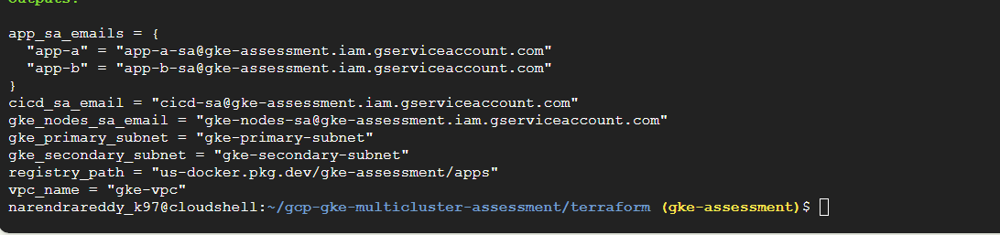

MCI created the whole load balancer by itself: backend services, health checks, a NEG per app in each cluster (us-central1-a and us-east1-b), the URL map and the VIP.

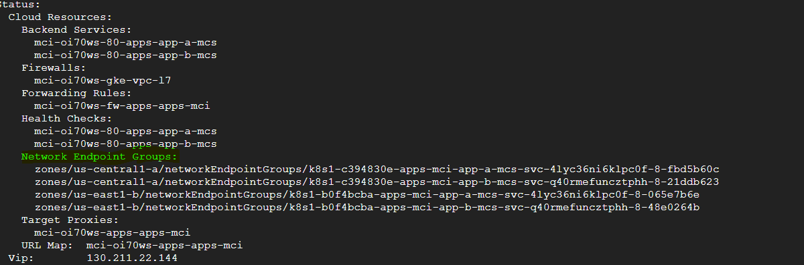

### App A is spread across pods
I curled App A in a loop. The hostname changes between the three pods, so the load balancer is really using all of them.

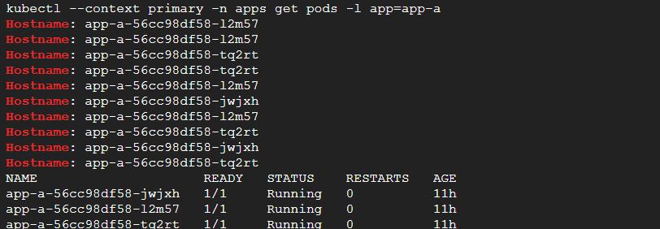
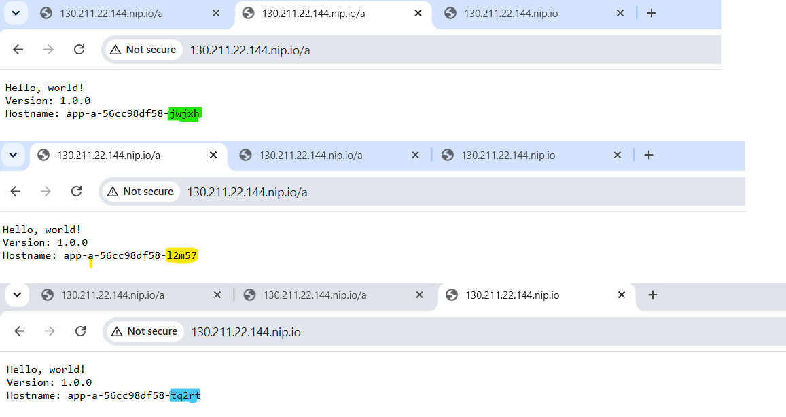

### App B and proximity routing
App B returns the cluster name and zone. From my location every request lands on `gke-primary` / `us-central1-a`. That is expected, since MCI sends you to the nearest healthy cluster. The response also shows `app-b-sa` as the service account, which shows Workload Identity is in use.

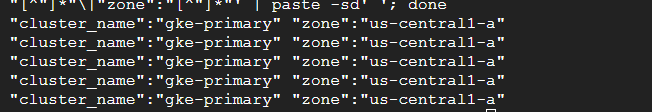
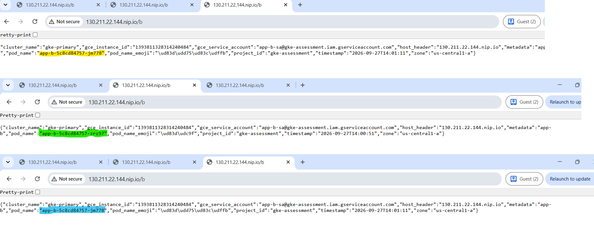

### Failover test: App A
I removed App A from the primary cluster. The primary had no App A pods, and the same URL kept working, now answered by the three pods in `gke-secondary`.

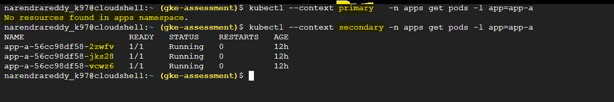
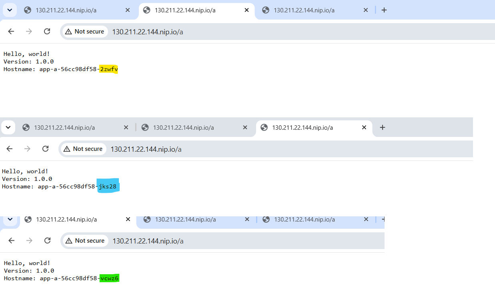

### Failover test: App B (with timestamps)
I ran a curl every 5 seconds and scaled App B to 0 in the primary:
```bash
kubectl --context primary -n apps scale deployment app-b --replicas=0
for i in $(seq 1 20); do echo -n "$(date +%T) "; curl -s http://$MCI_IP/b | grep -o '"cluster_name":"[^"]*"\|"zone":"[^"]*"' | paste -sd' '; sleep 5; done
```
At 14:10:55 it was still `gke-primary`. By 14:11:00 every answer came from `gke-secondary` in us-east1-b. I did not change anything else. The load balancer moved the traffic on its own. After the test I scaled it back to 3.

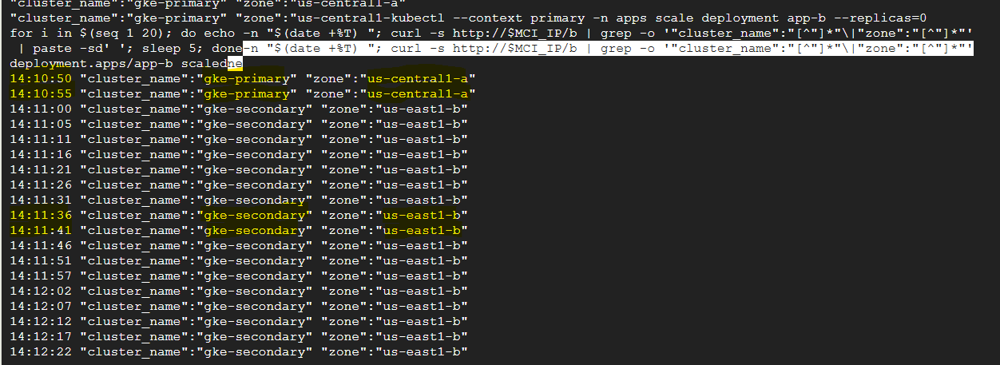
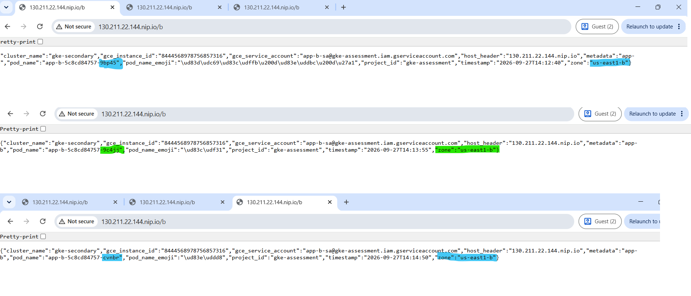

On the Grafana dashboard this window shows as a small burst of 5xx (the red part of the bar at 18:00 and 18:05). Those are the few requests that hit the primary while its pods were going away, before the health checks marked it down.

### Cloud Armor
Both backend services have `apps-waf` attached. A normal request gets 200. XSS and SQL injection attempts get 403.

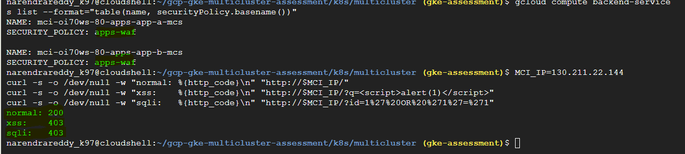

### Workload Identity
I started a pod with `app-a-ksa` and asked the metadata server who it is. It answered `app-a-sa@gke-assessment.iam.gserviceaccount.com`, so the KSA to GSA mapping works and no key file is involved. For the pod to actually get a token, the Google SA also needs the `roles/iam.workloadIdentityUser` binding. That turned out to be the cause of my Secret Manager test failure (see below).

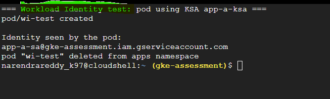

### Secret Manager (least privilege)
Terraform gives `secretAccessor` on `app-b-api-key` to `app-b-sa` only. The planned test is two pods calling Secret Manager with their own Workload Identity token:
- pod as `app-b-ksa` -> should get the secret value
- pod as `app-a-ksa` -> should get `403 PERMISSION_DENIED`

My test runs failed before they reached Secret Manager (401 / empty output). I traced it to a missing `workloadIdentityUser` binding, so the pods could not get a token. The binding is in `terraform/workload-identity.tf`. The end-to-end read test is still open. Full details are in `docs/troubleshooting.md` (issue 6).

### Logs in BigQuery
The load balancer logs land in `gke_logs.requests`. A count by status code shows the normal traffic (200), Cloud Armor blocks (403) and the failover window (502).

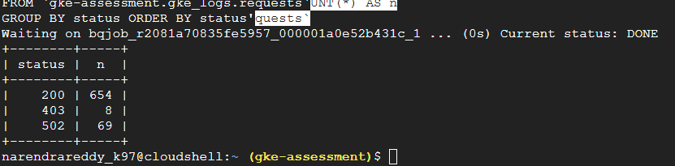

---

## 6. Grafana dashboard

Dashboard: **GKE Multi-cluster Observability** (JSON in `grafana/dashboard.json`). The saved time range is my test window, 2026-09-27 17:45 to 19:15 (Central).

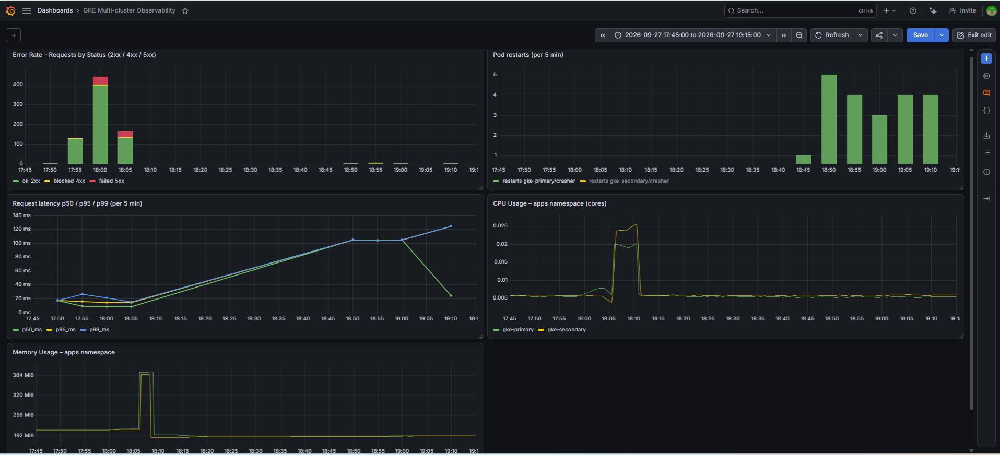

| Panel | Source | What it shows |
|---|---|---|
| Error Rate – Requests by Status | BigQuery `requests` | Requests per 5 min split into 2xx (green), 4xx (yellow, mostly Cloud Armor blocks) and 5xx (red). Error rate = red / whole bar. |
| Pod Restarts | BigQuery `events` | CrashLoopBackOff (`BackOff`) events per 5 min, by namespace/pod |
| Request Latency p50 / p95 / p99 | BigQuery `requests` | Latency of successful requests in ms |
| CPU Usage | Cloud Monitoring | CPU cores used by the `apps` namespace per cluster |
| Memory Usage | Cloud Monitoring | Non-evictable memory used by the `apps` namespace per cluster |

How to read my test window:
- **Error rate**: normal traffic at 17:55, the load test at 18:00, then red 5xx at 18:00 and 18:05 during the failover test. After that it goes back to zero errors.

  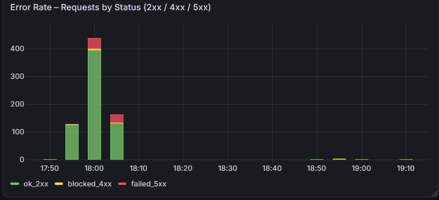
- **Pod restarts**: to test this panel I deployed a pod that exits on purpose (`crasher` in a `chaos-test` namespace). Kubernetes kept restarting it, about 3 to 5 BackOff events every 5 minutes. I deleted it after the test.

  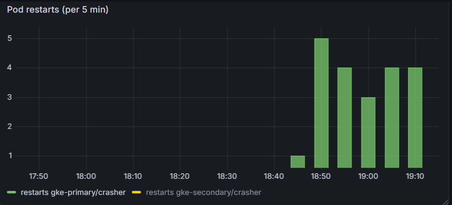
- **Latency**: during the tests p99 stayed under 30 ms. The later points (about 100 to 125 ms) are a few outside requests from the internet. LB latency includes the network time to the client, so far-away clients show higher numbers.

  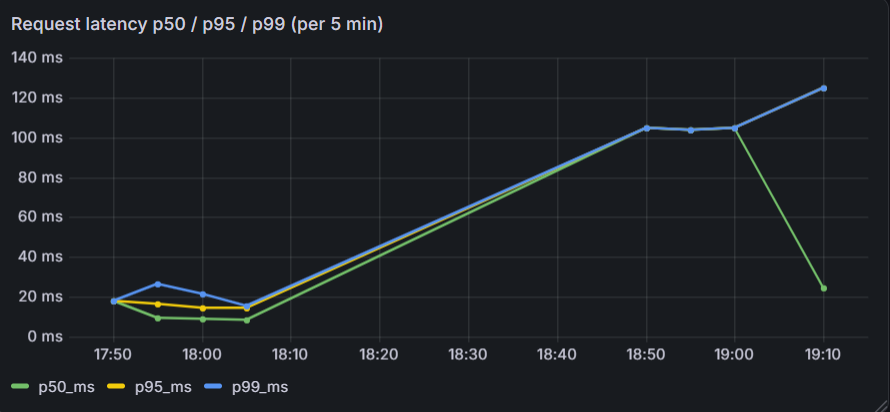
- **CPU / memory**: very low at baseline (about 0.005 cores and 200 MiB per cluster). The spike around 18:06 to 18:10 is from pods being recreated after the failover test. Both go back to baseline, so there is no leak.

  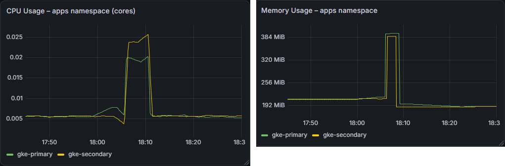

---

## 7. Design decisions

- **Multi-cluster Ingress instead of two separate load balancers + DNS failover.** One anycast IP, Google picks the closest healthy backend, and failover happens in seconds from health checks. DNS failover depends on TTLs and client caching.
- **Two regions, one project.** The assessment asked for one project. Two regions protect against a regional outage, and us-central1 / us-east1 are close enough to keep latency reasonable.
- **Stateless apps.** No data to replicate between regions, so failover is only a traffic decision. A real app with state would need something like Cloud SQL with cross-region replicas or Spanner.
- **Private nodes + Cloud NAT.** Nodes are not reachable from the internet. I kept the control plane endpoint public (with auth) because I worked from Cloud Shell. In production I would add authorized networks or make it private.
- **Container-native LB (NEGs).** The LB talks to pod IPs directly. Health checks are more accurate and there is no extra hop through kube-proxy.
- **Workload Identity over JSON keys.** Nothing to rotate or leak inside the cluster. One Google SA per app so each app only gets what it needs, which is how app-a is blocked from app-b's secret.
- **Secret value outside Terraform.** Terraform creates the secret and the IAM, but the value is added with gcloud so it is not in the state file.
- **Cloud Armor at the edge.** Bad requests are dropped before they reach the cluster. I used the preconfigured OWASP rules plus a simple per-IP rate limit.
- **Logs to BigQuery.** The assessment asked for error rates from BigQuery. It also gives me SQL over all LB and pod logs, and partitioned tables with 30-day expiry keep cost down.
- **Grafana Cloud.** No server to run myself. Grafana is outside GCP, so it uses a read-only service account key. In a real setup I would use Workload Identity Federation instead of a key.
- **Remote state in GCS.** State is shared, versioned and locked, not sitting on one laptop.

Things I would add with more time:
- Cloud Deploy or GitHub Actions to deploy to both clusters
- HTTPS with a Google-managed certificate
- Alerting in Grafana, for example 5xx over 5% for 5 minutes
- PodDisruptionBudgets and topology spread constraints
- A private control plane with authorized networks

---

## 8. Problems I ran into

The full write-up is in [`docs/troubleshooting.md`](docs/troubleshooting.md). The main one was Cloud Build failing to copy images because it ran as the default compute service account. The short list:

- Terraform not installed in Cloud Shell
- GitHub rejected my push because the `.terraform` provider binary (117 MB) was committed
- Cloud Shell IPv6 error during `terraform plan/apply`
- Cloud Build logs bucket permission error (main story)
- The logging service agent was missing when creating the BigQuery sinks
- Secret Manager test failed: the Workload Identity binding was missing, so pods could not get a token
- Grafana: wrong data source, the first error-rate graph was hard to read, and legend clicks hid lines

---

## 9. Cost and cleanup

Running cost was around $8 to $10 a day, mostly the two clusters' nodes, the load balancer and NAT.

To remove everything:
```bash
kubectl --context primary -n apps delete mci apps-mci    # let MCI remove its LB pieces first
cd terraform && terraform destroy
```
The state bucket is created outside Terraform, so delete it by hand if you no longer need it.
